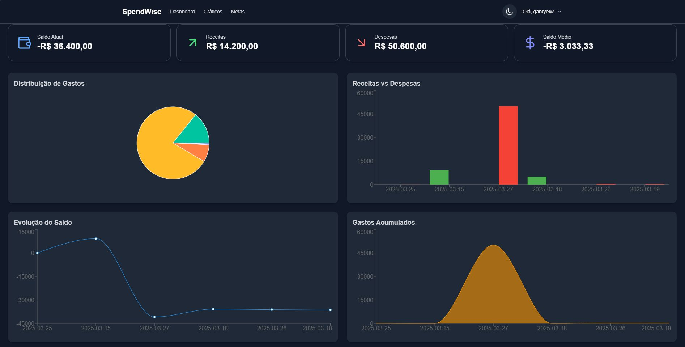
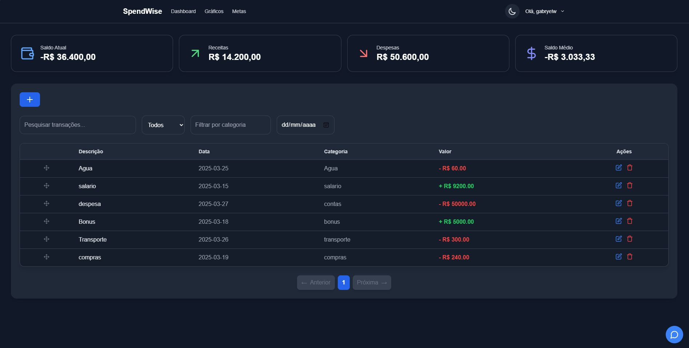

# SpendWise Frontend

<p align="center">
  
</p>

<p align="center">
  <strong>Manage your finances intelligently and visually with SpendWise Frontend!</strong>
</p>

---

## 📝 Description

**SpendWise Frontend** is the modern and responsive interface of the personal financial management system **SpendWise**. Developed with cutting-edge technologies, it offers an intuitive experience for users to manage their finances, track expenses and income, and interact with a **finance-specialized chatbot**.

### Key Features:
- **User Authentication**: Secure authentication via Supabase.
- **Financial Transaction Management**: Manage income, expenses, and categorization.
- **Intelligent Chatbot**: Get FAQs and recommendations based on your transactions.
- **Dynamic Charts**: Visualize your expenses and income with interactive charts.
- **Responsive Design**: Enjoy a seamless experience on any device with Tailwind CSS.

---

## 🚀 Main Features

- **Secure Authentication**: Integration with Supabase for user authentication.
- **Transaction Management**: Adding, editing, and deleting financial transactions.
- **Financial Chatbot**: Suggestions of FAQs and personalized recommendations based on user transactions.
- **Dynamic Charts**: Clear and interactive visualization of expenses and income.
- **Responsive UI**: Modern design adaptable to different devices.

---

## 🛠️ Technologies Used

- **Next.js**: React framework for building fast and scalable web applications.
- **TypeScript**: Adds static typing for greater code safety and productivity.
- **Tailwind CSS**: Utility-first CSS framework for creating modern and responsive interfaces.
- **Supabase**: Real-time authentication and database.
- **Lucide-React**: Icon library for a visually appealing interface.

---

## 📋 Installation Steps

Follow the steps below to set up and run the project locally:

1. **Clone the repository**:
   ```bash
   git clone https://github.com/Gabryel-w/SpendWise-FrontEnd.git
   cd SpendWise-FrontEnd
   ```

2. **Install dependencies**:
   ```bash
   npm install
   ```

3. **Configure the backend**:
   Follow the instructions in the SpendWise Backend repository to set up and run the backend.

4. **Run the project**:
   ```bash
   npm run dev
   ```

---

## 🌍 Live Demo

Check out the live version:  
🔗 [gabryelwillers.com.br](https://spendwise.app.br/)

---

## 🖼️ Screenshots





---

## 👨‍💻 Author

Developed by [Gabryel Willers](https://github.com/Gabryel-w). Let's connect and build something amazing!

<p align="center"> <strong>Transform your financial management with SpendWise Frontend! 💰🚀</strong> </p>